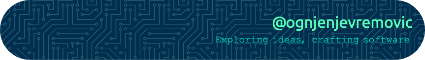

<h1 align="center">Hi there 👋, I'm Ognjen (usually referred to as Oggy)</h1>

  <em>
    Results-driven senior software engineer with over 9 years of experience 
    Architecting scalable, performant web applications with JavaScript & NodeJS 
    Passionate about clean code, mentorship, and open source contributions 💚
  </em>

### About Me

I'm a versatile fullstack developer with over a decade of professional experience building scalable and performant web applications. My expertise lies primarily in JavaScript/TypeScript and NodeJS ecosystems, solving complex problems and delivering high-quality software through clean, maintainable code.

Beyond coding, I am passionate about mentorship and fostering team growth by providing guidance, support, and constructive feedback. I believe **communication** and **collaboration** are key to delivering exceptional software.  

 

  
  
  
  
  
  
  
  
  
  
  
  
  
  
  
  
  
  
  
  
  
  
  
  
  
  
  
  
  
  
  

  

  
  
  
  
  
  
  
  
  
  
  
  
  
  
  
  
  
  
  
  
  
  
  
  
  
  
  
  
  

 

### What I'm Up To

- 👨‍💻 Senior Tech Lead driving scalable, performant web solutions and mentoring engineering teams remotely across Europe.  
- 🚀 Bootstrapped a B2B SaaS platform from the ground up — architected, developed, and managed all technical aspects including API design, CI/CD pipelines and integrations.  
- 💡 Passionate about building clean, maintainable code and fostering team growth through mentorship and collaboration.  
- 📚 Lifelong learner focused on evolving skills in modern web ecosystems, cloud-native architectures and developer experience.  
- 🛠️ Contributed to 15+ open source projects, including Node.js core modules and popular libraries like Fastify, Undici and Workbox.  
- 🌍 Based in Europe, working remotely and always open to connecting with fellow developers and entrepreneurs.  

 

  

  <em>Feel free to reach out — I’m always excited to connect and collaborate!</em>

---
